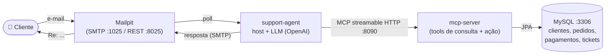

# Spring AI & MCP — Estudos

Repositório de estudos construído ao longo de um curso de **Spring AI** e **MCP (Model Context
Protocol)**. Vai do básico de LLMs (prompt, memória, structured output) até **RAG**, **tool
calling**, servidores/clientes **MCP** e culmina num **agente de IA autônomo** que trabalha uma
caixa de e-mails de suporte ponta a ponta (`support-agent-demo`).

> **Stack:** Java 25 · Spring Boot 4.1 · Spring AI 2.0 · OpenAI · MCP · Qdrant · MySQL/H2 · Docker

---

## 📌 Como o repositório é organizado

Não é um projeto único: é um **guarda-chuva de subprojetos independentes**. Cada subprojeto é
**self-contained** — tem seu próprio `pom.xml` e Maven wrapper, e é buildado/rodado por conta
própria. **Não existe POM pai/agregador.** A raiz guarda só as notas de estudo e a config do
repositório.

```
.
├── NOTES.md                <- notas detalhadas por tópico (o "diário" do estudo)
├── CONCEITOS.md            <- resumos conceituais (o "porquê" de cada coisa)
├── mise.toml               <- toolchain do repo (Java 25)
│
├── spring-ai-playground/   <- playground de features do Spring AI (chat OpenAI)
├── springai/               <- multimodalidade: transcrição/TTS de áudio e geração de imagem
│
├── mcpclient/              <- host MCP: consome servers MCP como tools
├── mcpserverstdio/         <- server MCP via stdio (help-desk local)
├── mcpserverremote/        <- server MCP via streamable HTTP (:8090) — progress/logging/sampling/elicitation
│
└── support-agent-demo/     <- 🏁 PROJETO FINAL: agente de suporte autônomo + seu server MCP
    ├── mcp-server/         <-    tools MCP (streamable HTTP :8090) sobre um MySQL semeado
    └── support-agent/      <-    o agente: observa uma caixa Mailpit, resolve e responde
```

Todos os comandos são executados **de dentro do subprojeto** (ex. `cd spring-ai-playground`),
sempre pelo Maven wrapper (`./mvnw` no Unix, `mvnw.cmd` no Windows).

---

## 🧠 Conceitos cobertos

| Área | O que foi explorado | Onde |
|------|---------------------|------|
| **Fundamentos** | Prompt template, prompt stuffing, system prompt, chat options | `spring-ai-playground` · NOTES §1–7 |
| **Structured Output** | Resposta do LLM convertida direto em objeto Java (`.entity(...)`) | `spring-ai-playground` · NOTES §3 |
| **Chat Memory** | Histórico por `CONVERSATION_ID`, persistente (H2 file) | `spring-ai-playground` · NOTES §8 |
| **RAG** | Busca semântica no **Qdrant**, chunking, cross-lingual, RAG modular, semantic cache | `spring-ai-playground` (profile `rag`) · NOTES §9–10 |
| **Tool Calling** | O LLM decide chamar métodos `@Tool`; com banco + `ToolContext` | `spring-ai-playground` · NOTES §11, §13 |
| **MCP** | Host/Client/Server; transports **stdio** e **streamable HTTP**; filtro/seleção de tools; progress, logging, **sampling**, **elicitation** | `mcpclient` + `mcpserver*` · NOTES §14 |
| **Multimodalidade** | Transcrição (Whisper), Text-to-Speech, geração de imagem | `springai` · NOTES §15 |
| **AI Agent** | Loop autônomo `Reason→Act→Observe→Repeat` juntando tudo | `support-agent-demo` · NOTES §16 |

> 📖 As explicações completas (com trechos de código e as pegadinhas que enfrentei) estão em
> **[`NOTES.md`](NOTES.md)**; os resumos conceituais, em **[`CONCEITOS.md`](CONCEITOS.md)**.

---

## 🏁 Projeto final — `support-agent-demo`

Um **agente de suporte autônomo** de e-commerce: ele lê a caixa de e-mails, entende o pedido do
cliente (status de pedido, cobrança, reembolso, garantia, pré-venda…), **toma a ação** cabível e
**responde o cliente** — sozinho, sem humano no meio. É a soma do curso: **tool calling + MCP +
structured output + system prompt**, amarrados pelo **loop autônomo** do Spring AI.

### Arquitetura



Como funciona, em uma frase por passo:

1. **`InboxMonitor`** faz polling na caixa Mailpit; cada e-mail não lido vira um `IncomingEmail`.
2. **`SupportAgent`** (um `ChatClient` com **todas** as tools do MCP + o system prompt) recebe o
   e-mail. O **Spring AI roda o loop de tool calling** — o LLM decide **quais** tools chamar e em
   **que ordem**: identifica o cliente, puxa pedidos/pagamentos, detecta cobrança duplicada, checa
   garantia, olha o histórico…
3. Só então **decide** e, se o dado justificar, **age** (emite refund) e **loga o ticket**.
4. A saída é **structured output** (`AgentResponse`: `replySubject` / `replyBody` /
   `operatorSummary`); **`SupportMailSender`** responde o cliente por SMTP, no idioma e tom dele.

As **tools** (a única janela do agente pros sistemas da empresa) ficam no `mcp-server`, separadas
em **leitura** (`lookup_customer_by_email`, `get_customer_orders`, `detect_duplicate_charges`,
`check_warranty`, `get_customer_ticket_history`, …) e **ação** (`issue_refund`,
`log_support_ticket`). A separação é de propósito: **mover dinheiro tem que ser deliberado**, nunca
efeito colateral de uma consulta.

### Cenários semeados (`db/init/02-seed.sql`)

O banco vem semeado para exercitar o agente ponta a ponta (datas relativas ao `CURDATE()`):

- **Goodwill** — jarra do liquidificador rachada pela **3ª vez** → o histórico prova a reincidência ⇒ reembolso de cortesia.
- **Pré-venda** — "o X200 funciona em 230V?" → respondido **direto das specs** do produto (sem pedido).
- **Cobrança duplicada** — "fui cobrada 2× no pedido #4471" → detecta as duas capturas ⇒ reembolsa **exatamente uma**.
- **Multilíngue/multi-intent** — cliente sarcástico, meio em hindi, com **dois** problemas.

---

## 🚀 Como rodar

### Pré-requisitos

- **Java 25** (fixado em [`mise.toml`](mise.toml); com [mise](https://mise.jdx.dev/): `mise install`).
- **`OPENAI_API_KEY`** exportada no ambiente — as apps leem `spring.ai.openai.api-key=${OPENAI_API_KEY}` e **não sobem sem ela**.
- **Docker** (para os subprojetos que usam Qdrant / MySQL / Mailpit via Docker Compose).

### Um subprojeto qualquer

```bash
cd spring-ai-playground
./mvnw spring-boot:run        # sobe em http://localhost:8080
# RAG (Qdrant + ingestão de documentos):
./mvnw spring-boot:run -Dspring-boot.run.profiles=rag
```

### O projeto final (`support-agent-demo`) — dois apps, duas stacks Docker

```bash
# 1) Sobe o server MCP + MySQL (o Compose é auto-iniciado; suba este PRIMEIRO)
cd support-agent-demo/mcp-server
./mvnw spring-boot:run                     # MCP streamable HTTP em :8090

# 2) Em outro terminal, sobe o agente + Mailpit
cd support-agent-demo/support-agent
./mvnw spring-boot:run                     # começa a observar a caixa

# 3) Injeta um e-mail de teste e veja o agente resolver
curl -X POST "http://localhost:8080/seed-mail?from=priya.sharma@example.com&subject=Charged%20twice&body=I%20was%20charged%20twice%20for%20order%204471"
# Acompanhe a caixa (e a resposta do agente) em http://localhost:8025
```

> ⚠️ O seed do MySQL só roda em **volume novo**. Para re-semear os cenários: `docker compose down -v`.

---

## 🧰 Toolchain

- **Java 25** (raiz `mise.toml`), aplicado a todos os subprojetos Java.
- **Spring Boot 4.1.0**, **Spring AI 2.0.0** (BOM-managed).
- Build: `./mvnw clean package` · Testes: `./mvnw test` (rodados de dentro de cada subprojeto).

---

## 📚 Documentação de estudo

- **[`NOTES.md`](NOTES.md)** — notas detalhadas por tópico, com código e troubleshooting real.
- **[`CONCEITOS.md`](CONCEITOS.md)** — resumos conceituais (de LLM/tokens/embeddings a agentes).
- **[`CLAUDE.md`](CLAUDE.md)** — guia da estrutura do repositório e comandos.

---

<sub>Repositório de estudos — construído para aprender, com anotações e experimentos ao longo do curso.</sub>
